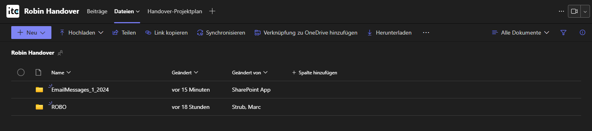
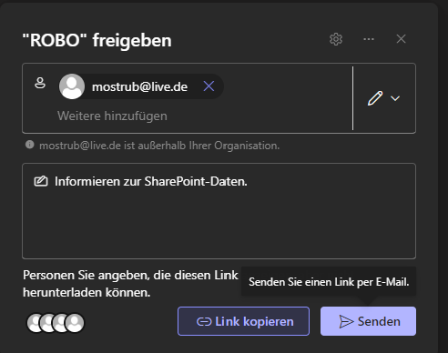

# Share file://

**Requirements:**

* To fulfill these requirements, you must be a member of the Teams Channel and either be the Owner or possess Elevated permissions. Additionally, it is necessary to have a subchannel specifically designated for external individuals. This ensures that the data stored in the SharePoint of your Teams Channel remains segregated. Failure to implement this segregation may lead to issues related to data access and sharing.

**Anforderungen:**

* Um diese Anforderungen zu erfüllen, müssen Sie Mitglied des Teams-Channels sein und entweder der Eigentümer sein oder erhöhte Berechtigungen besitzen. Darüber hinaus ist es erforderlich, einen Unterkanal für externe Personen zu haben. Dies stellt sicher, dass die in SharePoint Ihres Teams-Channels gespeicherten Daten getrennt bleiben. Die Nichtumsetzung dieser Trennung kann zu Problemen im Zusammenhang mit dem Zugriff auf Daten und der gemeinsamen Nutzung führen.

***


[ysd](https://app.gitbook.com/o/ewSwbK8leIUC349FF1UH/snippet/4309)


<figure><figcaption></figcaption></figure>

<figure><figcaption></figcaption></figure>

<figure><figcaption></figcaption></figure>

<figure><figcaption></figcaption></figure>

<figure><figcaption></figcaption></figure>

<figure><figcaption></figcaption></figure>

<figure><figcaption></figcaption></figure>

<figure><figcaption></figcaption></figure>

<figure><figcaption></figcaption></figure>

<figure><figcaption></figcaption></figure>

<figure><figcaption></figcaption></figure>

<figure><figcaption></figcaption></figure>

<figure><figcaption></figcaption></figure>

<figure><figcaption></figcaption></figure>

<figure><figcaption></figcaption></figure>

<figure><figcaption></figcaption></figure>

<figure><figcaption></figcaption></figure>

<figure><figcaption></figcaption></figure>

